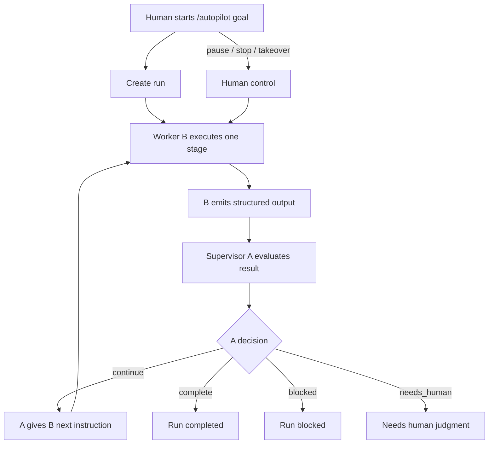
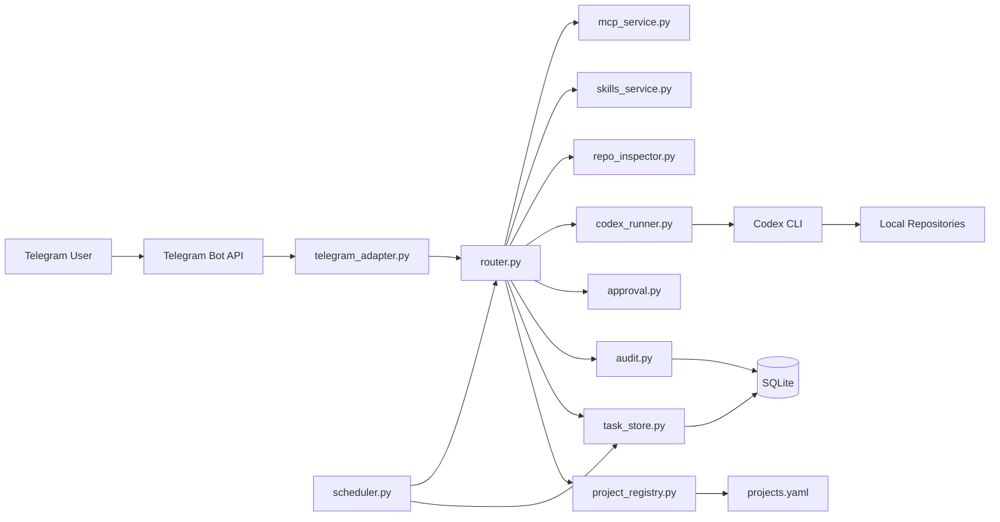
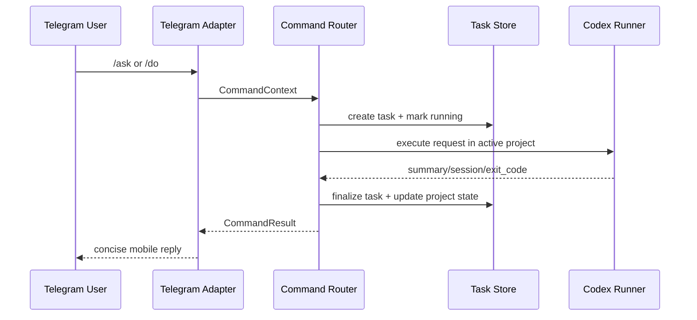

<p align="center">
  
</p>

<h1 align="center">OpenFish</h1>
<p align="center"><strong>Single-User, Telegram-Driven Local Codex Assistant</strong></p>

<p align="center">
  <a href="README_CN.md">中文版</a> |
  <a href="https://pypi.org/project/openfish/">PyPI</a> |
  <a href="LICENSE">MIT License</a> |
  <a href="CONTRIBUTING.md">Contributing</a> |
  <a href="SECURITY.md">Security</a> |
  <a href="CHANGELOG.md">Changelog</a>
</p>

<p align="center">
  
  
  
  
  
  
</p>

OpenFish is a local-first remote coding assistant for one trusted owner.
It lets you control local repositories from Telegram while execution, approvals, state, and audit logs remain on your machine.

## Product Scope

OpenFish is built for:

- single-user operation
- project-scoped continuity
- conservative execution boundaries
- concise mobile-friendly Telegram interaction

OpenFish is not:

- a multi-user bot platform
- a public remote shell
- a cloud orchestration system

## ><> Install

Install from PyPI:

```bash
pip install openfish
```

Then bootstrap and start:

```bash
openfish install
openfish configure
openfish check
openfish start
```

If you are developing from source instead:

```bash
pip install -e ./mvp_scaffold
```

## ><> Quick Start

Primary lifecycle commands:

- `openfish install`
- `openfish uninstall`
- `openfish configure`
- `openfish init-home`
- `openfish check`
- `openfish start`
- `openfish stop`
- `openfish restart`
- `openfish status`
- `openfish logs`

Update behavior is mode-aware:

- repository mode: `openfish update` performs git-based self-update
- package/home mode: use `python -m pip install --upgrade openfish`

If you want a user-home runtime instead of repository-local runtime data:

```bash
openfish init-home
export OPENFISH_HOME=~/.config/openfish
openfish check
openfish start
```

Uninstall:

```bash
openfish uninstall
```

Uninstall and purge runtime data:

```bash
openfish uninstall --purge-runtime
```

If you do not know your Telegram user ID yet, send `/start` to the bot first, then run:

```bash
openfish tg-user-id
```

Legacy script entrypoint remains available for compatibility:

```bash
bash mvp_scaffold/scripts/install_start.sh start
```

## Core Capabilities

- Project lifecycle: list, select, add, disable, archive
- Task lifecycle: ask, do, resume, retry, cancel
- Autopilot lifecycle: create a long-running supervisor-worker run, inspect status/context, pause, resume, single-step, takeover, stop
- Task controls: current task, task list, cancel, delete, bulk cleanup
- Scheduling: add, list, run, pause, enable, delete periodic tasks
- Approval flow: approve, reject, note/reason continuation
- Project memory: notes, recent summaries, status snapshots, paginated memory view
- Session browser: unified OpenFish/native Codex session list and import
- MCP controls: inspect, enable, disable
- Service controls: version, update-check, update, restart, logs
- File handling: upload analysis, local file download, public GitHub repo clone into project

## Telegram UX

- High-frequency home keyboard for `Projects`, `Ask`, `Do`, `Status`, `Resume`, `Diff`, `Schedule`, `More`, `Help`
- Button-first approvals and task controls
- Autopilot cards with status/context views, pause/resume/stop controls, takeover prompts, and paused single-step execution
- Persisted step-by-step wizards for project add, schedule add, and approval note/reason
- Default `stream` UI mode with `/ui reset` to return to default behavior
- Status, projects, schedule, approval, more, memory, and current-task cards prefer in-place updates
- Short-window outbound dedup and recent message reference tracking for cleaner chats

## What's New

- `autopilot` supervisor-worker mode for long-running tasks that would otherwise keep stopping for another human “continue”
- background autonomous loop with explicit stop conditions
- `/autopilots` for recent run management
- `/autopilot-status` and `/autopilot-context` for observability
- pause/resume/stop, human takeover, and paused single-step execution
- Telegram buttons for Autopilot from the home/more/service surfaces

Autopilot workflow:



## ><> Docker

OpenFish also includes an isolated Docker runtime for long-running self-hosted deployment.

```bash
openfish docker-init
```

Current Docker mode is isolated from the host runtime layout:

- OpenFish home lives in a Docker volume at `/var/lib/openfish`
- the default project root is fixed inside the container at `/workspace/projects`
- Codex auth state lives in a Docker volume at `/root/.codex`
- runtime state, logs, SQLite, and `projects.yaml` live in named Docker volumes
- repository-local `.env`, `projects.yaml`, and `mvp_scaffold/data` are not mounted into the container

Docker helper commands:

- `openfish docker-init`
- `openfish docker-configure`
- `openfish docker-up`
- `openfish docker-down`
- `openfish docker-health`
- `openfish docker-logs`
- `openfish docker-ps`
- `openfish docker-login-codex`
- `openfish docker-codex-status`

Recommended flow:

1. `openfish docker-init`
2. `openfish docker-login-codex`
3. `openfish docker-codex-status`

`openfish docker-login-codex` supports:

- device auth login
- importing a local `auth.json` path such as `~/.codex/auth.json`
- pasting raw `auth.json` content directly

## Architecture

### Module View



### Runtime Flow



## ><> Command Overview

Core commands:

- `/projects`, `/use <project>`, `/status`
- `/ask <question>`, `/do <task>`, `/resume [task_id] [instruction]`
- `/autopilot <goal>`, `/autopilots`, `/autopilot-status [id]`, `/autopilot-context [id]`
- `/autopilot-step [id]`, `/autopilot-pause [id]`, `/autopilot-resume [id]`, `/autopilot-stop [id]`
- `/autopilot-takeover <instruction>`
- `/approve [note]`, `/reject [reason]`, `/cancel`
- `/diff`, `/memory`, `/note <text>`, `/help`

Extended commands:

- `/project-root [abs_path]`
- `/project-add`, `/project-disable`, `/project-archive`
- `/tasks`, `/task-current`, `/task-cancel`, `/task-delete`, `/tasks-clear`
- `/sessions`, `/session`, `/session-import`
- `/skills`, `/skill-install`
- `/schedule-add`, `/schedule-list`, `/schedule-run`, `/schedule-pause`, `/schedule-enable`, `/schedule-del`
- `/mcp`, `/mcp-enable`, `/mcp-disable`
- `/model`, `/ui`, `/ui-reset`
- `/version`, `/update-check`, `/update`, `/restart`, `/logs`, `/logs-clear`
- `/download-file`, `/github-clone`, `/upload_policy`

Telegram quick buttons cover all command capabilities:

- no-arg commands execute directly
- high-friction commands enter persisted step-by-step wizards

## Documentation

User-facing docs:

- Chinese homepage: [README_CN.md](README_CN.md)
- Persistence details: [docs/PERSISTENCE_ARCHITECTURE.md](docs/PERSISTENCE_ARCHITECTURE.md)
- Install/Deploy/Usage manual (Chinese): [docs/安装部署和使用手册.md](docs/安装部署和使用手册.md)

## Repository Layout

- Runtime app: `mvp_scaffold/`
- Docs: `docs/`
- Config samples: `env.example`, `projects.example.yaml`
- Packaged runtime resources: `mvp_scaffold/src/resources/`

## Security Notes

- Rotate bot token immediately if it appears in logs or screenshots.
- Do not commit `.env`, runtime data, or local secret-bearing config.
- Keep allowed project directories minimal and explicit.
