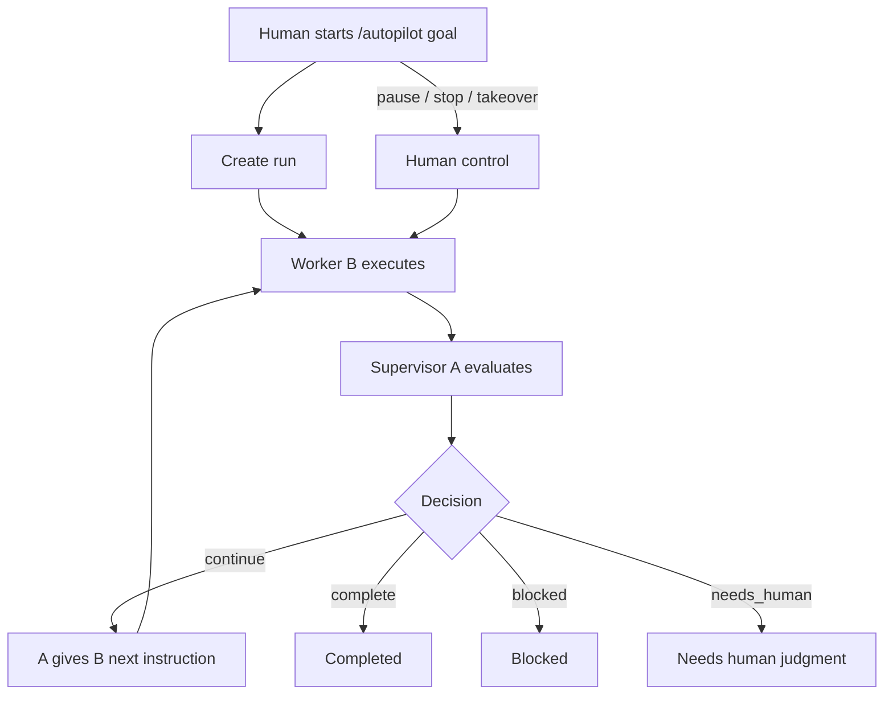
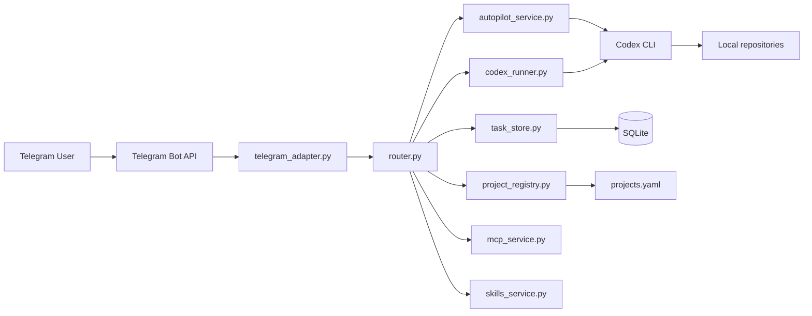

<p align="center">
  
</p>

<h1 align="center">OpenFish</h1>
<p align="center"><strong>Single-User, Telegram-Driven, Local-First Codex Assistant</strong></p>

<p align="center">
  <a href="README_CN.md">中文版</a> |
  <a href="https://pypi.org/project/openfish/">PyPI</a> |
  <a href="LICENSE">MIT License</a> |
  <a href="CONTRIBUTING.md">Contributing</a> |
  <a href="SECURITY.md">Security</a> |
  <a href="CHANGELOG.md">Changelog</a>
</p>

<p align="center">
  
  
  
  
</p>

OpenFish lets one trusted owner control local Codex work from Telegram.
Code, execution, approvals, runtime state, and audit logs stay on your machine.

## Maintenance Mode (Paused)

As of March 19, 2026, OpenFish is in maintenance mode while development moves to a new direction.

- no planned feature releases on this repository for now
- security or critical-breakage fixes may still be accepted
- PRs and issues are still welcome, but response time can be slow

Before opening new work, read:

- [Pause and Restart Checklist](docs/PAUSE_AND_RESTART_CHECKLIST.md)
- [Next Direction Notes](docs/NEXT_DIRECTION.md)

## What's New in v1.3.0

- natural-language-first Telegram entry: plain text now routes to ask, do, autopilot, note, schedule, digest, project switch, GitHub clone/import, or a clarification step
- one live home dashboard as the primary status surface instead of multiple competing live cards
- mobile-first buttons and wizards for approvals, project switching, schedules, task output, and Autopilot control
- stronger Autopilot run panels, raw-stream review, and run-scoped takeover actions

## What It Is

OpenFish is designed for:

- single-user operation
- project-scoped continuity
- conservative local execution
- mobile-friendly Telegram control

OpenFish is not:

- a multi-user bot platform
- a public remote shell
- a cloud orchestration layer

## Install

Install from PyPI:

```bash
pip install openfish
```

Bootstrap and start:

```bash
openfish install
openfish configure
openfish check
openfish start
```

Develop from source:

```bash
pip install -e ./mvp_scaffold
```

Use a home runtime instead of repository-local state:

```bash
openfish init-home
export OPENFISH_HOME=~/.config/openfish
openfish check
openfish start
```

Uninstall:

```bash
openfish uninstall
```

Uninstall and purge runtime data:

```bash
openfish uninstall --purge-runtime
```

## Daily Flow

Typical daily workflow:

1. open Telegram and start from `/home`
2. say what you want in plain language, for example:
   - `help me clean up yesterday's logs`
   - `switch to ops project`
   - `every 30 minutes check service health`
   - `what happened today`
3. let OpenFish route the request, infer or ask for the project when needed
4. use the live home dashboard as the default status surface
5. click buttons for approve, reject, pause, stop, takeover, output review, or project switching

Telegram surfaces already included:

- unified live home dashboard
- service dashboard
- current context card
- project/task/session/MCP controls
- approval cards and step-by-step wizards
- task result actions and full-output review
- Autopilot raw stream and run-scoped panels

## Core Capabilities

- Project lifecycle: list, select, add, disable, archive
- Task lifecycle: ask, do, resume, retry, cancel, delete, bulk cleanup
- Scheduling: add, list, run, pause, enable, delete
- Digest and review: project digest, long-output review, file export back to Telegram
- Memory and sessions: notes, summaries, session browser, session import
- MCP controls: inspect, enable, disable
- Service controls: version, update-check, update, restart, logs, logs-clear
- GitHub and file helpers: clone public repos, inspect uploads, send files back to Telegram

## Autopilot

Autopilot is OpenFish's long-running supervisor-worker mode.

- `A` is the supervisor
- `B` is the executor
- the human mainly observes, pauses, resumes, stops, or takes over

Current Autopilot features:

- background autonomous loop
- explicit stop conditions
- status and context cards
- raw output visibility for A and B
- pause, resume, stop, takeover
- single-step execution while paused
- multi-run list via `/autopilots`

Autopilot workflow:



Main Autopilot commands:

- `/autopilot <goal>`
- `/autopilots`
- `/autopilot-status [id]`
- `/autopilot-context [id]`
- `/autopilot-step [id]`
- `/autopilot-pause [id]`
- `/autopilot-resume [id]`
- `/autopilot-stop [id]`
- `/autopilot-takeover <instruction>`

## Assistant Entry

Telegram no longer has to start from `/ask` or `/do`.

Plain-text requests now route into the right path first and only fall back to explicit commands when needed:

- questions -> `/ask`
- execution requests -> `/do`
- long-running self-propelled requests -> `/autopilot`
- notes -> `/note`
- schedule-like requests -> schedule wizard
- project switching -> `/use`
- digest-style requests -> `/digest`
- bare GitHub repo links -> project import wizard

Commands remain available as power-user shortcuts and for deterministic control.

## Project Templates

Projects can now be created from template directories and started directly in Autopilot mode.

Template flow:

1. define a template root
2. list available templates
3. create a project from a template
4. choose `normal` or `autopilot`
5. if `autopilot`, OpenFish can start the run immediately

Template commands:

- `/project-template-root [abs_path]`
- `/project-templates`
- `/project-add <key> --template <name> --mode autopilot`

Template directory conventions:

- each subdirectory under the template root is a template
- optional metadata file: `.openfish-template.yaml`
- template directories can carry their own `AGENTS.md`, skills, MCP setup, and workspace conventions

Example metadata:

```yaml
name: Recon Workspace
description: Collect domains, subdomains, and URLs
default_autopilot_goal: Collect public target surface for this project
```

## Docker

OpenFish also ships an isolated Docker runtime.

Initialize:

```bash
openfish docker-init
```

Docker helper commands:

- `openfish docker-configure`
- `openfish docker-up`
- `openfish docker-down`
- `openfish docker-health`
- `openfish docker-logs`
- `openfish docker-ps`
- `openfish docker-login-codex`
- `openfish docker-codex-status`

Current Docker runtime behavior:

- OpenFish home lives in `/var/lib/openfish`
- default project root is `/workspace/projects`
- Codex auth lives in `/root/.codex`
- runtime state uses named Docker volumes

## Architecture



## Command Surface

High-frequency commands:

- `/projects`, `/use <project>`, `/status`, `/health`
- `/ask <question>`, `/do <task>`, `/resume [task_id] [instruction]`
- `/task-current`, `/tasks`, `/cancel`
- `/autopilot <goal>`, `/autopilot-status`, `/autopilot-context`
- `/approve [note]`, `/reject [reason]`
- `/diff`, `/digest`, `/memory`, `/note <text>`, `/help`

Configuration and extended commands:

- `/project-root [abs_path]`
- `/project-add`, `/project-disable`, `/project-archive`
- `/project-template-root [abs_path]`, `/project-templates`
- `/sessions`, `/session`, `/session-import`
- `/schedule-add`, `/schedule-list`, `/schedule-run`, `/schedule-pause`, `/schedule-enable`, `/schedule-del`
- `/mcp`, `/mcp-enable`, `/mcp-disable`
- `/model`, `/ui`, `/ui-reset`
- `/version`, `/update-check`, `/update`, `/restart`, `/logs`, `/logs-clear`
- `/download-file`, `/github-clone`, `/upload_policy`

## Documentation

- Chinese homepage: [README_CN.md](README_CN.md)
- Changelog: [CHANGELOG.md](CHANGELOG.md)
- Persistence architecture: [docs/PERSISTENCE_ARCHITECTURE.md](docs/PERSISTENCE_ARCHITECTURE.md)
- Install/deploy/usage manual: [docs/安装部署和使用手册.md](docs/安装部署和使用手册.md)
- Autopilot design: [docs/AUTOPILOT_V1_DESIGN.md](docs/AUTOPILOT_V1_DESIGN.md)
- Autopilot workflow: [docs/AUTOPILOT_WORKFLOW.md](docs/AUTOPILOT_WORKFLOW.md)

## Repository Layout

- App runtime: `mvp_scaffold/`
- Docs: `docs/`
- Config samples: `env.example`, `projects.example.yaml`
- Packaged runtime resources: `mvp_scaffold/src/resources/`

## Security Notes

- Rotate bot tokens immediately if they appear in logs or screenshots.
- Do not commit `.env`, runtime data, or local secret-bearing files.
- Keep project path permissions minimal and explicit.
