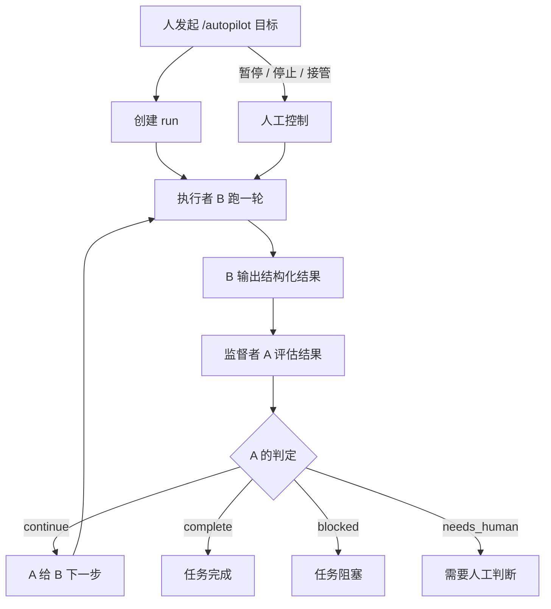
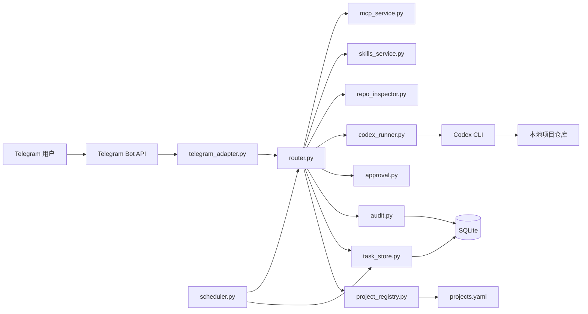
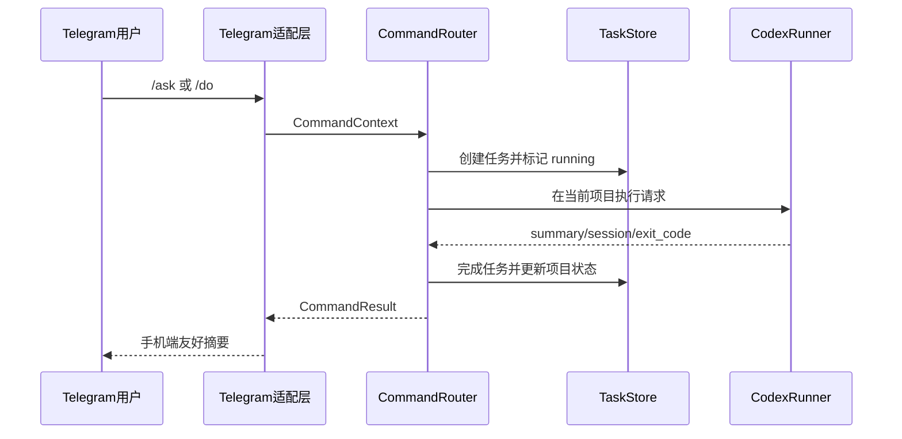

<p align="center">
  
</p>

<h1 align="center">OpenFish（小鱼）</h1>
<p align="center"><strong>单用户、Telegram 驱动、本机运行的 Codex 远程助手</strong></p>

<p align="center">
  <a href="README.md">English</a> |
  <a href="https://pypi.org/project/openfish/">PyPI</a> |
  <a href="LICENSE">MIT License</a> |
  <a href="CONTRIBUTING.md">贡献指南</a> |
  <a href="SECURITY.md">安全策略</a> |
  <a href="CHANGELOG.md">更新日志</a>
</p>

<p align="center">
  
  
  
  
  
  
</p>

OpenFish 面向一个可信 Owner，目标是让你离开工位时也能通过 Telegram 持续推进本地项目开发。
系统坚持本地优先：代码、执行、状态、审批、审计都留在你的机器上。

## 产品定位

OpenFish 适合：

- 单用户场景
- 以项目为边界的连续性管理
- 默认保守的执行策略
- 手机端可读的简洁交互

OpenFish 不做：

- 多用户 Bot 平台
- 公网远程 Shell
- 云端编排系统

## ><> 安装

先通过 PyPI 安装 `><> openfish`：

```bash
pip install openfish
```

然后初始化并启动：

```bash
openfish install
openfish configure
openfish check
openfish start
```

如果你是在源码仓库里开发：

```bash
pip install -e ./mvp_scaffold
```

## ><> 快速开始

统一通过 `><> openfish` CLI 使用：

- `openfish install`
- `openfish configure`
- `openfish check`
- `openfish start`

当前主生命周期命令：

- `openfish install`
- `openfish uninstall`
- `openfish configure`
- `openfish init-home`
- `openfish check`
- `openfish start`
- `openfish stop`
- `openfish restart`
- `openfish status`
- `openfish logs`

更新行为按安装模式区分：

- 仓库模式：`openfish update` 走 git 自更新
- 包/home 模式：使用 `python -m pip install --upgrade openfish`

如果你想把运行时数据放到用户目录，而不是仓库目录：

```bash
openfish init-home
export OPENFISH_HOME=~/.config/openfish
openfish check
openfish start
```

卸载：

```bash
openfish uninstall
```

卸载并清理运行时配置与数据：

```bash
openfish uninstall --purge-runtime
```

如果你还不知道自己的 Telegram 用户 ID，先给 bot 发 `/start`，再执行：

```bash
openfish tg-user-id
```

旧脚本入口仍保留兼容：

```bash
bash mvp_scaffold/scripts/install_start.sh start
```

## 核心能力

- 项目生命周期：查看、切换、新增、停用、归档
- 任务生命周期：`/ask`、`/do`、`/resume`、`/retry`、`/cancel`
- Autopilot 生命周期：创建长期 supervisor-worker run、查看状态/上下文、暂停、恢复、单步推进、人工接管、停止
- 任务管理：当前任务、任务列表、取消、删除、批量清理
- 定时任务：新增、查看、触发、暂停、启用、删除
- 审批流程：`/approve`、`/reject`、备注/原因延续
- 项目记忆：笔记、任务摘要、状态快照、分页查看
- 会话浏览：统一查看 OpenFish 与本机 Codex 会话并导入
- MCP 控制：查看、启用、停用
- 服务控制：版本、更新检查、自更新、重启、日志
- 文件处理：上传分析、本机文件下载到 Telegram、公开 GitHub 仓库下载到项目目录

## Telegram 交互

- 高频主键盘：`项目`、`提问`、`执行`、`状态`、`继续`、`变更`、`定时`、`更多`、`帮助`
- 审批和任务控制优先按钮化
- Autopilot 卡片支持状态/上下文查看、暂停/恢复/停止、人工接管，以及暂停态单步推进
- 新增项目、定时任务、审批备注/拒绝原因都支持可恢复向导
- 默认 `stream` 模式，可通过 `/ui reset` 回到默认
- `状态`、`项目`、`定时`、`审批`、`更多`、`记忆`、`当前任务` 卡片优先原地更新
- 发送链路有短窗口去重和最近消息引用跟踪，减少刷屏

## 本次更新

- 新增 `autopilot` supervisor-worker 长任务模式，解决长任务频繁停下来等人发一句“继续”的问题
- 新增后台自治循环，并带明确停止条件
- 新增 `/autopilots`，可查看和管理最近多个 run
- 新增 `/autopilot-status`、`/autopilot-context` 观察视图
- 支持暂停、恢复、停止、人工接管，以及暂停态单步推进
- 首页、更多、服务面板都已接入 Autopilot 入口和控制按钮

Autopilot 工作流：



## ><> Docker 运行

仓库已经提供 Docker 独立运行模式，可用于长期自托管部署：

```bash
openfish docker-init
```

当前 Docker 模式已经改成独立运行态：

- OpenFish home 固定在 Docker volume `/var/lib/openfish`
- 默认项目根目录固定为 `/workspace/projects`
- Codex 登录态保存在 Docker volume `/root/.codex`
- 运行时状态、日志、SQLite、`projects.yaml` 都放在 named volumes
- 不再直接复用宿主机仓库里的 `.env`、`projects.yaml`、`mvp_scaffold/data`

可用的 Docker 辅助命令：

- `openfish docker-init`
- `openfish docker-configure`
- `openfish docker-up`
- `openfish docker-down`
- `openfish docker-health`
- `openfish docker-logs`
- `openfish docker-ps`
- `openfish docker-login-codex`
- `openfish docker-codex-status`

推荐流程：

1. `openfish docker-init`
2. `openfish docker-login-codex`
3. `openfish docker-codex-status`

`openfish docker-login-codex` 支持：

- 官方 device auth 登录
- 导入本机 `~/.codex/auth.json` 或任意 auth.json 路径
- 直接粘贴原始 `auth.json` 内容

## 架构

### 模块视图



### 运行流程



## ><> 命令总览

核心命令：

- `/projects`, `/use <project>`, `/status`
- `/ask <question>`, `/do <task>`, `/resume [task_id] [instruction]`
- `/autopilot <goal>`, `/autopilots`, `/autopilot-status [id]`, `/autopilot-context [id]`
- `/autopilot-step [id]`, `/autopilot-pause [id]`, `/autopilot-resume [id]`, `/autopilot-stop [id]`
- `/autopilot-takeover <instruction>`
- `/approve [note]`, `/reject [reason]`, `/cancel`
- `/diff`, `/memory`, `/note <text>`, `/help`

扩展命令：

- `/project-root [abs_path]`
- `/project-add`, `/project-disable`, `/project-archive`
- `/tasks`, `/task-current`, `/task-cancel`, `/task-delete`, `/tasks-clear`
- `/sessions`, `/session`, `/session-import`
- `/skills`, `/skill-install`
- `/schedule-add`, `/schedule-list`, `/schedule-run`, `/schedule-pause`, `/schedule-enable`, `/schedule-del`
- `/mcp`, `/mcp-enable`, `/mcp-disable`
- `/model`, `/ui`, `/ui-reset`
- `/version`, `/update-check`, `/update`, `/restart`, `/logs`, `/logs-clear`
- `/download-file`, `/github-clone`, `/upload_policy`

快捷按钮覆盖全部命令能力：

- 无参数命令可直接点击执行
- 高频有参操作会进入可恢复的分步向导

## 文档导航

面向使用者：

- Persistence 说明：[docs/PERSISTENCE_ARCHITECTURE.md](docs/PERSISTENCE_ARCHITECTURE.md)
- 安装部署与使用手册：[docs/安装部署和使用手册.md](docs/安装部署和使用手册.md)

## 仓库结构

- 运行主目录：`mvp_scaffold/`
- 文档目录：`docs/`
- 配置样例：`env.example`, `projects.example.yaml`
- 包内运行资源：`mvp_scaffold/src/resources/`

## 安全提示

- Token 若出现在日志或截图中，请立即轮换。
- 不要提交 `.env`、运行时数据目录、含敏感信息的本地配置。
- 项目路径授权建议最小化并显式配置。
