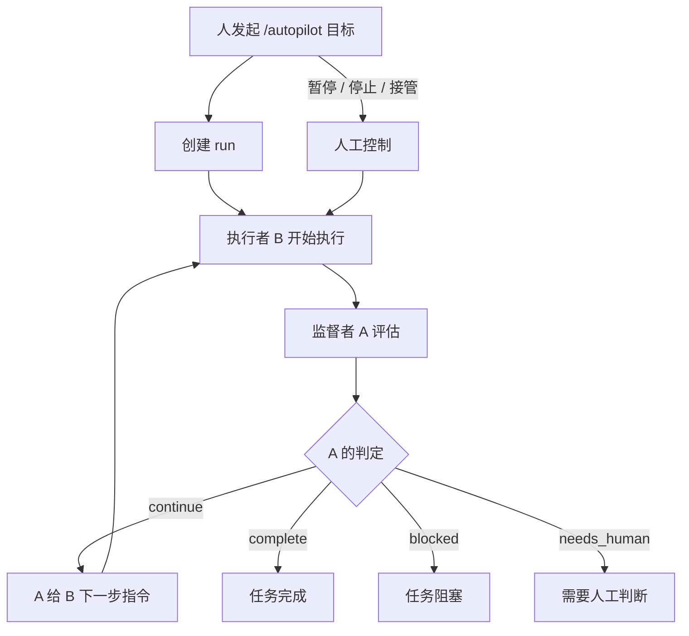
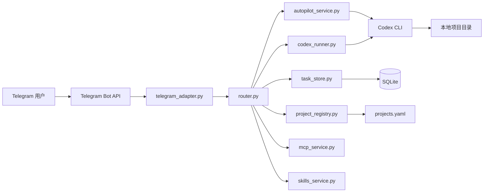

<p align="center">
  
</p>

<h1 align="center">OpenFish（小鱼）</h1>
<p align="center"><strong>单用户、Telegram 驱动、本机优先的 Codex 助手</strong></p>

<p align="center">
  <a href="README.md">English</a> |
  <a href="https://re13orn.github.io/openfish/">官网</a> |
  <a href="https://pypi.org/project/openfish/">PyPI</a> |
  <a href="LICENSE">MIT License</a> |
  <a href="CONTRIBUTING.md">贡献指南</a> |
  <a href="SECURITY.md">安全策略</a> |
  <a href="CHANGELOG.md">更新日志</a>
</p>

<p align="center">
  
  
  
  
</p>

OpenFish 面向一个可信 Owner，让你离开工位时也能继续通过 Telegram 控制本地 Codex 工作流。
代码、执行、审批、运行状态、审计日志都保留在你的机器上。

## v1.3.0 这次重点

- Telegram 默认入口改成自然语言优先：普通文本会先路由到 ask、do、autopilot、note、schedule、digest、项目切换、GitHub 仓库导入等路径
- 首页控制台收成唯一主状态面，不再让多张 live 卡同时争抢注意力
- 审批、项目切换、定时任务、任务输出、Autopilot 控制都更偏手机按钮和向导交互
- Autopilot 的 run 面板、原始流回顾、按 run 定向接管继续收口

## 它是什么

OpenFish 适合：

- 单用户场景
- 以项目为边界的连续工作
- 默认保守的本地执行
- 手机上可读、可控的 Telegram 交互

OpenFish 不做：

- 多用户 Bot 平台
- 公网远程 Shell
- 云端编排层

## 安装

通过 PyPI 安装：

```bash
pip install openfish
```

初始化并启动：

```bash
openfish install
openfish configure
openfish check
openfish start
```

如果你是在源码仓库中开发：

```bash
pip install -e ./mvp_scaffold
```

如果你希望运行时数据放到用户目录：

```bash
openfish init-home
export OPENFISH_HOME=~/.config/openfish
openfish check
openfish start
```

卸载：

```bash
openfish uninstall
```

卸载并清理运行时配置与数据：

```bash
openfish uninstall --purge-runtime
```

## 日常使用路径

典型工作流：

1. 打开 Telegram，从 `/home` 开始
2. 直接说人话，比如：
   - `帮我把昨天的日志整理一下`
   - `切换到 ops 项目`
   - `每隔30分钟检查服务状态`
   - `今天发生了什么`
3. 让 OpenFish 自动路由请求，必要时自动推断项目或让你点一下选择
4. 把首页控制台当成默认状态面
5. 需要时直接点按钮做审批、暂停、停止、接管、查看完整输出或切项目

已经内置的 Telegram 控制面：

- 统一 live 首页控制台
- 服务面板
- 当前上下文卡片
- 项目 / 任务 / 会话 / MCP 控制
- 审批卡片和分步向导
- 任务结果后续动作和完整输出查看
- Autopilot 原始流与 run 面板

## 核心能力

- 项目生命周期：查看、切换、新增、停用、归档
- 任务生命周期：提问、执行、继续、重试、取消、删除、批量清理
- 定时任务：新增、查看、触发、暂停、启用、删除
- 摘要与回顾：项目摘要、长输出回顾、文件回传 Telegram
- 记忆与会话：笔记、摘要、会话浏览、会话导入
- MCP 控制：查看、启用、停用
- 服务控制：版本、更新检查、自更新、重启、日志
- GitHub 与文件辅助：公开仓库克隆、上传分析、文件回传 Telegram

## Autopilot

Autopilot 是 OpenFish 的长期任务 supervisor-worker 模式。

- `A` 是监督者 / 指挥者
- `B` 是执行者
- 人主要负责观察、暂停、恢复、停止或接管

当前 Autopilot 已支持：

- 后台自治循环
- 明确停止条件
- 状态卡片和上下文卡片
- A/B 原始输出可见
- 暂停、恢复、停止、人工接管
- 暂停态单步执行
- `/autopilots` 管理最近多个 run

Autopilot 工作流：



Autopilot 主要命令：

- `/autopilot <goal>`
- `/autopilots`
- `/autopilot-status [id]`
- `/autopilot-context [id]`
- `/autopilot-step [id]`
- `/autopilot-pause [id]`
- `/autopilot-resume [id]`
- `/autopilot-stop [id]`
- `/autopilot-takeover <instruction>`

## 助理入口

现在 Telegram 不必再从 `/ask` 或 `/do` 开始。

普通文本会先走意图路由，再决定真正执行哪条路径：

- 问题类 -> `/ask`
- 执行类 -> `/do`
- 长任务自治 -> `/autopilot`
- 笔记类 -> `/note`
- 定时类 -> 定时任务向导
- 切项目类 -> `/use`
- 摘要/回顾类 -> `/digest`
- 直接发 GitHub 仓库链接 -> 项目导入向导

命令仍然保留，作为 power-user 的快捷方式和确定性控制入口。

## 项目模板

现在可以基于模板目录创建项目，并直接以 Autopilot 模式开跑。

模板使用路径：

1. 设置模板根目录
2. 查看可用模板
3. 基于模板创建项目
4. 选择 `normal` 或 `autopilot`
5. 如果选择 `autopilot`，OpenFish 可在创建后直接启动 run

模板命令：

- `/project-template-root [绝对路径]`
- `/project-templates`
- `/project-add <key> --template <name> --mode autopilot`

模板目录约定：

- 模板根目录下每个子目录就是一个模板
- 可选模板元数据文件：`.openfish-template.yaml`
- 模板目录可以自带 `AGENTS.md`、skills、MCP 配置和工作目录约定

元数据示例：

```yaml
name: Recon Workspace
description: 收集域名、子域名和 URL
default_autopilot_goal: 对目标进行公开资产信息收集
```

## Docker

OpenFish 也提供独立 Docker 运行态。

初始化：

```bash
openfish docker-init
```

Docker 辅助命令：

- `openfish docker-configure`
- `openfish docker-up`
- `openfish docker-down`
- `openfish docker-health`
- `openfish docker-logs`
- `openfish docker-ps`
- `openfish docker-login-codex`
- `openfish docker-codex-status`

当前 Docker 运行方式：

- OpenFish home 在 `/var/lib/openfish`
- 默认项目根目录是 `/workspace/projects`
- Codex 登录态在 `/root/.codex`
- 运行时状态使用 named volumes

## 架构



## 命令面

高频命令：

- `/projects`, `/use <project>`, `/status`, `/health`
- `/ask <question>`, `/do <task>`, `/resume [task_id] [instruction]`
- `/task-current`, `/tasks`, `/cancel`
- `/autopilot <goal>`, `/autopilot-status`, `/autopilot-context`
- `/approve [note]`, `/reject [reason]`
- `/diff`, `/digest`, `/memory`, `/note <text>`, `/help`

配置和扩展命令：

- `/project-root [绝对路径]`
- `/project-add`, `/project-disable`, `/project-archive`
- `/project-template-root [绝对路径]`, `/project-templates`
- `/sessions`, `/session`, `/session-import`
- `/schedule-add`, `/schedule-list`, `/schedule-run`, `/schedule-pause`, `/schedule-enable`, `/schedule-del`
- `/mcp`, `/mcp-enable`, `/mcp-disable`
- `/model`, `/ui`, `/ui-reset`
- `/version`, `/update-check`, `/update`, `/restart`, `/logs`, `/logs-clear`
- `/download-file`, `/github-clone`, `/upload_policy`

## 文档导航

- 英文首页：[README.md](README.md)
- 更新日志：[CHANGELOG.md](CHANGELOG.md)
- 持久化架构：[docs/PERSISTENCE_ARCHITECTURE.md](docs/PERSISTENCE_ARCHITECTURE.md)
- 安装、部署、使用手册：[docs/安装部署和使用手册.md](docs/安装部署和使用手册.md)
- Autopilot 设计：[docs/AUTOPILOT_V1_DESIGN.md](docs/AUTOPILOT_V1_DESIGN.md)
- Autopilot 工作流：[docs/AUTOPILOT_WORKFLOW.md](docs/AUTOPILOT_WORKFLOW.md)

## 仓库结构

- 主运行目录：`mvp_scaffold/`
- 文档目录：`docs/`
- 配置样例：`env.example`, `projects.example.yaml`
- 包内运行资源：`mvp_scaffold/src/resources/`

## 安全提示

- Token 一旦出现在日志或截图中，请立即轮换。
- 不要提交 `.env`、运行时数据、含敏感信息的本地文件。
- 项目路径授权建议最小化并显式配置。
