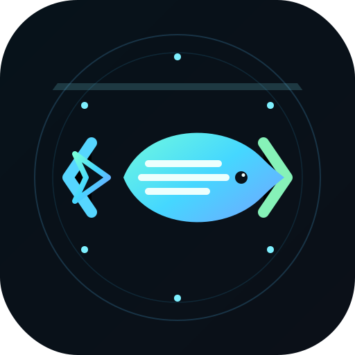

<p align="center">
  
</p>

<h1 align="center">OpenFish（小鱼）</h1>
<p align="center"><strong>单用户、Telegram 驱动、本机运行的 Codex 远程助手</strong></p>

<p align="center">
  <a href="README.md">English</a> |
  <a href="LICENSE">MIT License</a> |
  <a href="CONTRIBUTING.md">贡献指南</a> |
  <a href="SECURITY.md">安全策略</a> |
  <a href="CHANGELOG.md">更新日志</a>
</p>

<p align="center">
  
  
  
  
  
</p>

OpenFish 面向一个可信 Owner，目标是让你离开工位时也能通过 Telegram 持续推进本地项目开发。
系统坚持本地优先：代码、执行、状态、审批、审计都留在你的机器上。

## 架构图


架构说明文档： [docs/ARCHITECTURE.md](docs/ARCHITECTURE.md)

## 产品定位

OpenFish 适合：

- 单用户场景
- 以项目为边界的连续性管理
- 默认保守的执行策略
- 手机端可读的简洁交互

OpenFish 不做：

- 多用户 Bot 平台
- 公网远程 Shell
- 云端编排系统

## 核心能力

- 项目生命周期：查看、切换、新增、停用、归档
- 任务生命周期：`/ask`、`/do`、`/resume`、`/retry`、`/cancel`
- 定时任务：新增/查看/触发/暂停/启用/删除
- 审批流程：`/approve`、`/reject`
- 项目记忆：笔记、任务摘要、状态快照
- 文件安全分析：上传后按后缀/大小/路径规则处理

## Telegram 交互演进

- 高频主键盘：`项目`、`提问`、`执行`、`状态`、`继续`、`变更`、`定时`、`更多`、`帮助`
- 审批流程优先按钮化，备注/原因向导也绑定显式 `approval_id`
- 新增项目、定时任务、模板执行、审批备注/拒绝原因都支持可恢复的分步向导
- chat 级 UI 模式支持精简/详细两种信息密度
- `状态`、`项目`、`定时`、`审批`、`更多` 这些卡片会优先更新已有消息，而不是不断堆新消息
- 发送链路增加短窗口去重和最近消息引用跟踪，减少重复输出

## 快速开始

先安装 `openfish` 命令入口：

```bash
pip install -e ./mvp_scaffold
```

然后统一通过 `openfish` CLI 使用：

```bash
openfish install
openfish configure
openfish check
openfish start
```

当前主生命周期命令已经是原生 CLI：

- `openfish install`
- `openfish configure`
- `openfish init-home`
- `openfish check`
- `openfish start`
- `openfish stop`
- `openfish restart`
- `openfish status`
- `openfish logs`

更新行为现在按安装模式区分：

- 仓库模式：`openfish update` 走 git 自更新
- 包/home 模式：使用 `python -m pip install --upgrade openfish`

如果你想把运行时数据放到用户目录，而不是仓库目录，可以先初始化 home 模式：

```bash
openfish init-home
export OPENFISH_HOME=~/.config/openfish
openfish check
openfish start
```

如果你还不知道自己的 Telegram 用户 ID，先给 bot 发 `/start`，再执行：

```bash
openfish tg-user-id
```

旧脚本入口仍保留兼容：

```bash
bash mvp_scaffold/scripts/install_start.sh start
```

## Docker 运行

仓库已经提供 Docker 运行骨架，可用于长期自托管部署：

```bash
openfish docker-up
```

当前 Docker 方案默认：

- 使用仓库根目录的 `.env`
- 挂载 `mvp_scaffold/projects.yaml`
- 挂载本机 `~/.codex`
- 将宿主机工作区挂到容器内 `/workspace`

Docker 是可选部署方式。对个人本机使用场景，仍建议优先使用 `openfish` CLI。

可用的 Docker 辅助命令：

- `openfish docker-up`
- `openfish docker-down`
- `openfish docker-logs`
- `openfish docker-ps`

## 命令总览

核心命令：

- `/projects`, `/use <project>`, `/status`
- `/ask <question>`, `/do <task>`, `/resume [task_id] [instruction]`
- `/approve [note]`, `/reject [reason]`, `/cancel`
- `/diff`, `/memory`, `/note <text>`, `/help`

扩展命令：

- `/project-root [abs_path]`
- `/project-add`, `/project-disable`, `/project-archive`
- `/skills`, `/skill-install`
- `/schedule-add`, `/schedule-list`, `/schedule-run`, `/schedule-pause`, `/schedule-enable`, `/schedule-del`
- `/start`, `/last`, `/retry`, `/upload_policy`

快捷按钮覆盖全部命令能力：

- 无参数命令可直接点击执行
- 高频有参操作会进入可恢复的分步向导

## 文档导航

面向使用者：

- 架构说明：[docs/ARCHITECTURE.md](docs/ARCHITECTURE.md)
- 持久化说明：[docs/PERSISTENCE_ARCHITECTURE.md](docs/PERSISTENCE_ARCHITECTURE.md)
- 安装部署与使用手册：[docs/安装部署和使用手册.md](docs/安装部署和使用手册.md)

## 仓库结构

- 运行主目录：`mvp_scaffold/`
- 文档目录：`docs/`
- 配置样例：`env.example`, `projects.example.yaml`
- 数据库结构：`schema.sql`

## 安全提示

- Token 若出现在日志/截图中，请立即轮换。
- 不要提交 `.env`、运行时数据目录、含敏感信息的本地配置。
- 项目路径授权建议最小化并显式配置。
