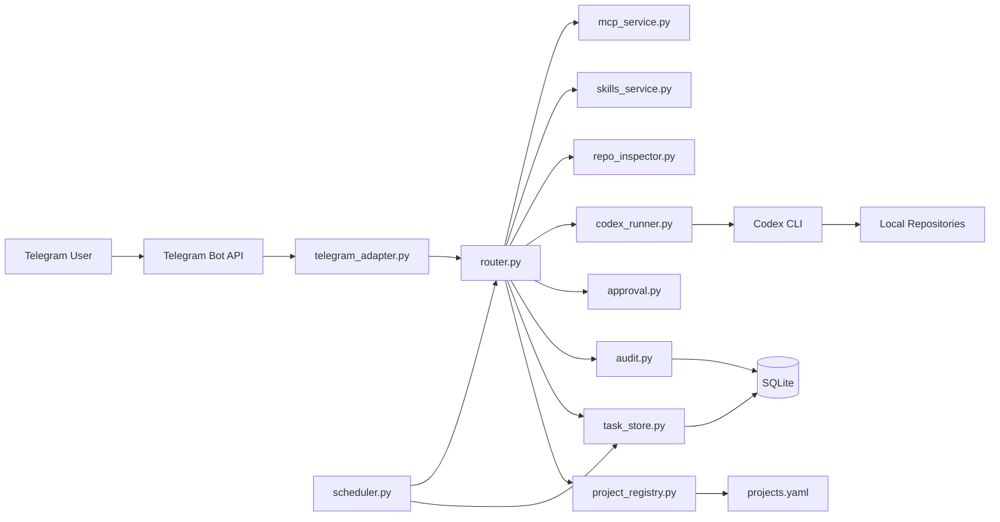
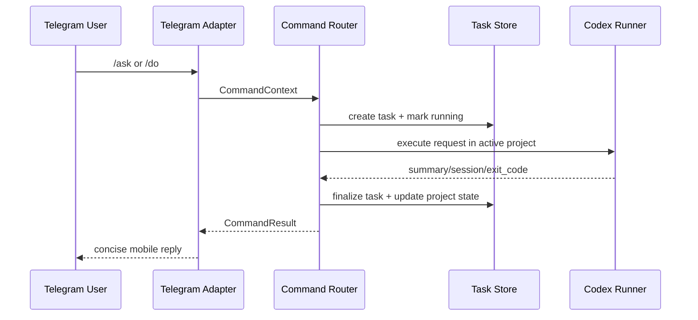

# OpenFish Architecture

## Overview

OpenFish is a single-process, local-first assistant:

- Telegram is the remote UI.
- The service runs on the owner's machine.
- Task/project/audit state is stored in local SQLite.
- Codex CLI executes inside the selected project directory.
- Telegram interaction is split into message builders, view builders, delivery sink, and adapter flow control.

## Architecture Diagram

## Module View

## Telegram Interaction Layer

OpenFish now treats Telegram as a small UI system, not just a command transport.

- `telegram_messages.py`: reusable prompt/error/hint text
- `telegram_views.py`: keyboards, panels, and result markups
- `telegram_sink.py`: outbound delivery, retry policy, typing indicator, dedup, recent message references, message editing
- `telegram_adapter.py`: update handling, callback routing, wizard flow, and command execution orchestration

This keeps three concerns separate:

- what to say
- what buttons to show
- how to deliver or update the Telegram message

## Runtime Flow

## Telegram Rendering Model

- High-frequency actions use the main keyboard.
- High-friction actions use persisted step-by-step wizards.
- `/status`, `/projects`, `/schedule-list`, approval panel, and more panel prefer updating the latest card instead of sending a fresh message every time.
- Approval actions are bound to explicit `approval_id` values, and callback handling validates both current pending state and recent card context before acting.

## Persistence Boundary

- Local SQLite: users, active project, tasks, approvals, schedules, memory, audit.
- `projects.yaml`: project registry and allowed paths.
- Local filesystem: source repos, logs, uploaded temp files.

This keeps continuity at project level across service restarts.

See also: [Persistence Architecture](PERSISTENCE_ARCHITECTURE.md)
