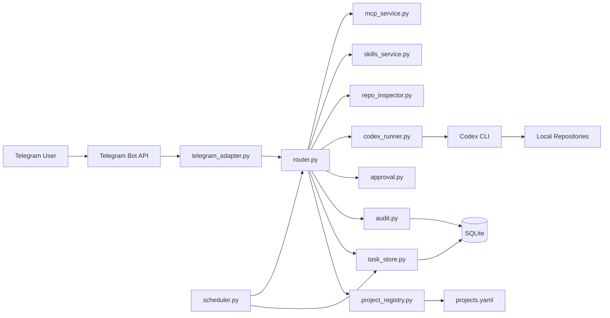
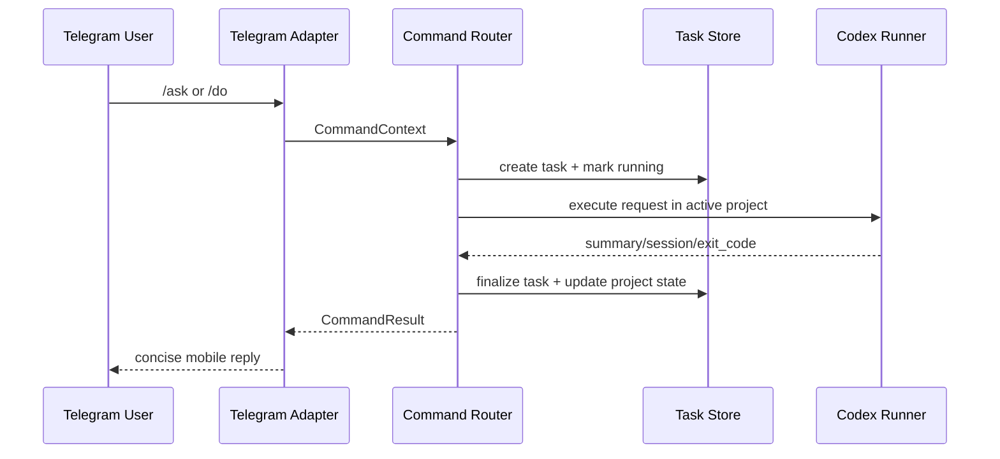

# OpenFish Architecture

## Overview

OpenFish is a single-process, local-first assistant:

- Telegram is the remote UI.
- The service runs on the owner's machine.
- Task/project/audit state is stored in local SQLite.
- Codex CLI executes inside the selected project directory.

## Architecture Diagram

## Module View

## Runtime Flow

## Persistence Boundary

- Local SQLite: users, active project, tasks, approvals, schedules, memory, audit.
- `projects.yaml`: project registry and allowed paths.
- Local filesystem: source repos, logs, uploaded temp files.

This keeps continuity at project level across service restarts.
