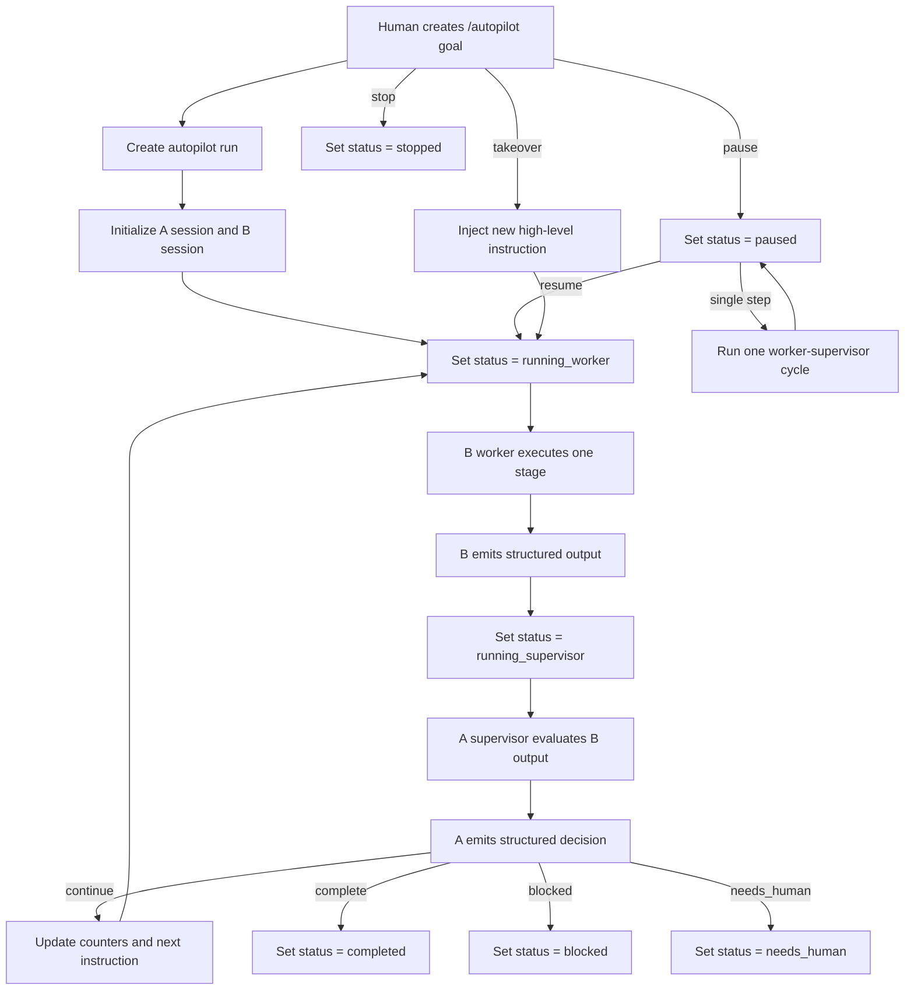
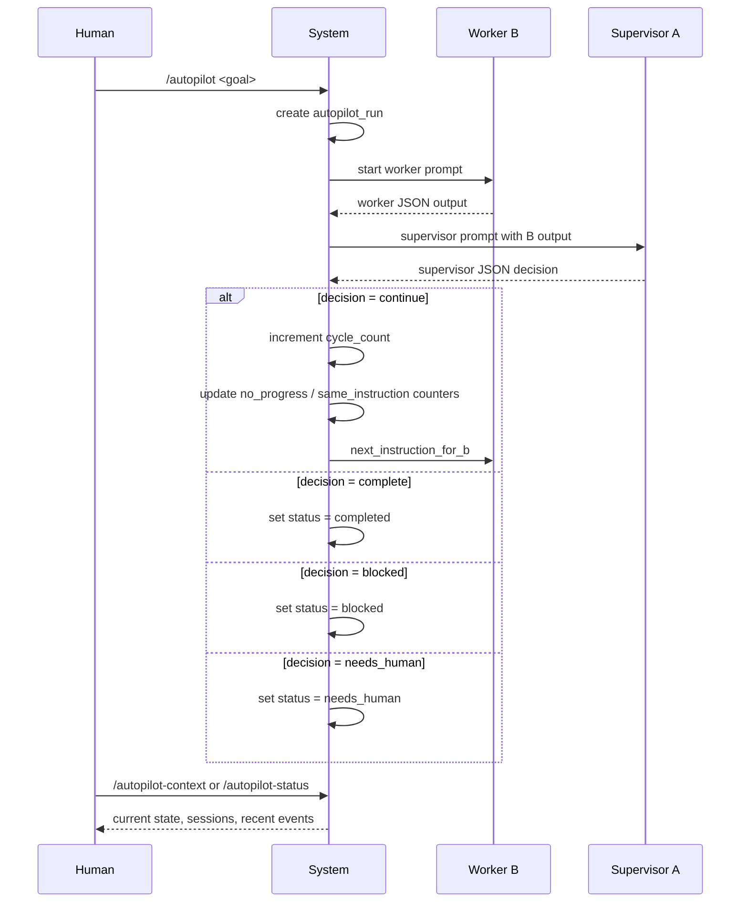
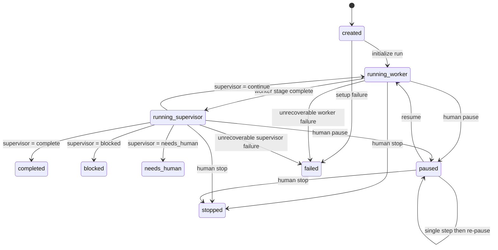
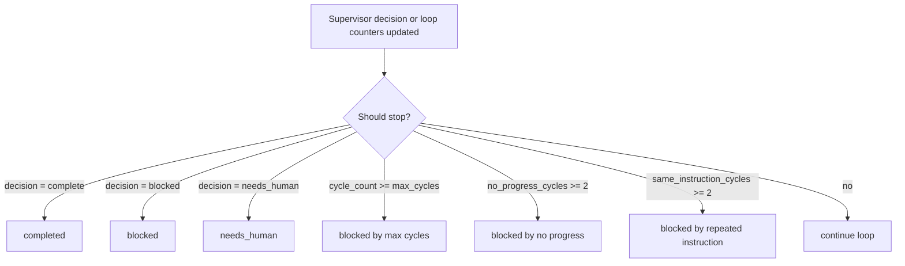
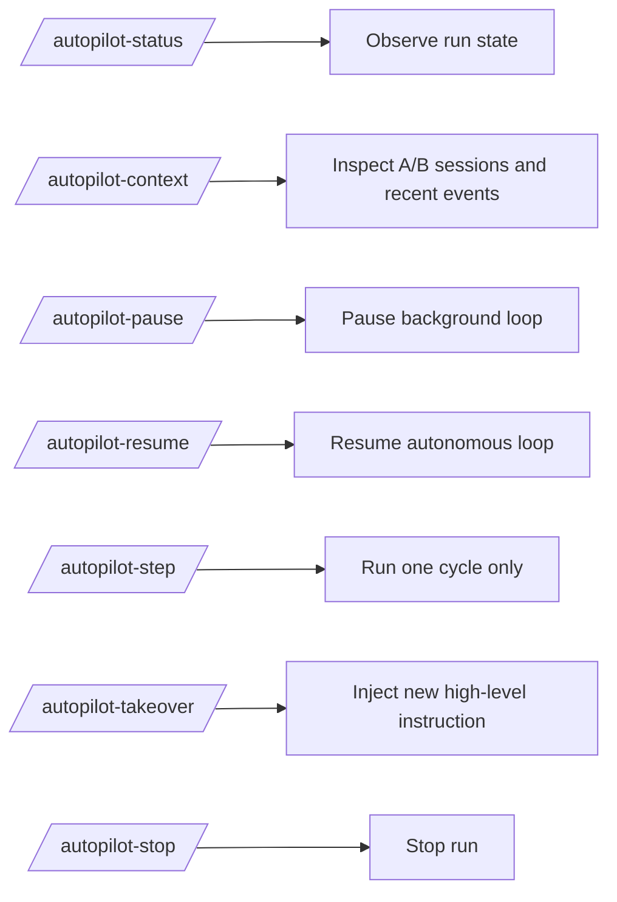

# OpenFish Autopilot Workflow

## Overview

Autopilot is a supervisor-worker execution loop:

- `A`: supervisor
- `B`: worker
- `Human`: observer, controller, optional takeover

The human starts the run once.
After that, the system keeps driving the loop until:

- the task is complete
- the run is blocked
- human intervention is required
- the owner pauses or stops it

## Top-Level Flow

## Cycle Detail

## State Machine

## Stop Rules

## Human Control Surface

## Mental Model

Keep the system model simple:

- `Human` decides the goal and only intervenes when needed
- `B` does the work
- `A` decides whether `B` should continue
- `System` enforces loop limits and stop rules

This is not free-form multi-agent chat.
It is a constrained execution loop with observability and control.
