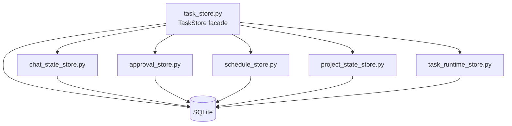

# OpenFish Persistence Architecture

## Goal

OpenFish keeps `TaskStore` as the stable facade used by `router.py`, `telegram_adapter.py`, and `scheduler.py`, but the actual SQLite responsibilities are now split by domain.

This keeps external call sites stable while making the persistence layer easier to evolve and test.

## Current Layout

## Store Boundaries

### `TaskStore`

Responsibilities:

- public facade for the rest of the application
- dataclass outputs such as `StatusSnapshot`, `TaskRecord`, `PendingApprovalRecord`, `MemorySnapshot`
- small cross-domain orchestration that touches more than one store

Examples:

- `cancel_latest_active_task()` needs both task runtime state and approval cancellation
- `get_status_snapshot()` assembles data from active project selection, project runtime state, schedules, and recent failures

### `ChatStateStore`

Responsibilities:

- active project per chat
- wizard state
- UI mode
- user default project fallback
- outbound Telegram delivery reference tracking used for card reuse/editing

Tables:

- `chat_context`
- `user_preferences`

Important `chat_context` fields now also include:

- `pending_flow_json`
- `ui_mode`
- `last_outbound_message_id`
- `last_outbound_dedup_key`
- `last_outbound_context`
- `last_outbound_sent_at`

### `ApprovalStore`

Responsibilities:

- approval request creation
- approval decision persistence
- pending approval lookup
- cancelling pending approvals for one task

Tables:

- `approvals`

### `ScheduleStore`

Responsibilities:

- scheduled task CRUD
- enable/disable
- claiming due items atomically
- recording last run result

Tables:

- `scheduled_tasks`

### `ProjectStateStore`

Responsibilities:

- project runtime pointers used by `/status`
- branch / dirty state
- project session reset
- owner notes and project summary memory
- registry seed memory

Tables:

- `project_state`
- `project_memory`
- reads from `scheduled_tasks` and `tasks` for status assembly helpers

### `TaskRuntimeStore`

Responsibilities:

- task creation
- task lifecycle transitions
- interrupted task recovery
- task events
- task artifacts
- latest/resumable task lookup

Tables:

- `tasks`
- `task_events`
- `task_artifacts`

## Typical Call Flow

### Normal `/do` or `/ask`

1. `router.py` calls `TaskStore.create_task()`
2. `TaskStore` delegates to `TaskRuntimeStore`
3. execution finishes
4. `router.py` calls:
   - `TaskStore.finalize_task()`
   - `TaskStore.update_project_state_after_task()`
5. `TaskStore` delegates to `TaskRuntimeStore` and `ProjectStateStore`

### Approval path

1. `router.py` calls `TaskStore.mark_task_waiting_approval()`
2. task status transition goes through `TaskRuntimeStore`
3. `router.py` calls `TaskStore.create_approval_request()`
4. approval row is stored by `ApprovalStore`
5. `/approve` or `/reject` resolves through `ApprovalStore`
6. approval-related Telegram callbacks are validated against explicit `approval_id` and recent panel/status-card references

### Scheduler path

1. `scheduler.py` calls `TaskStore.claim_due_scheduled_tasks()`
2. `TaskStore` delegates to `ScheduleStore`
3. after execution, `TaskStore.record_scheduled_task_run()` delegates back to `ScheduleStore`

### Telegram card reuse path

1. `telegram_adapter.py` emits a send request with one logical `context`, for example `sending status result`
2. `telegram_sink.py` computes a dedup key and checks recent outbound delivery state
3. if an eligible recent card exists for that context, the sink edits that Telegram message
4. otherwise it sends a new message
5. successful delivery writes the latest outbound reference back through `ChatStateStore`

## Why This Split Helps

- smaller unit tests for each persistence concern
- lower merge conflict pressure in `task_store.py`
- easier future migrations because schema ownership is clearer
- fewer reasons to open one giant file for every storage change

## Current Rule

If a persistence change touches exactly one domain table family, it should usually go into the matching store module first, not directly into `task_store.py`.
